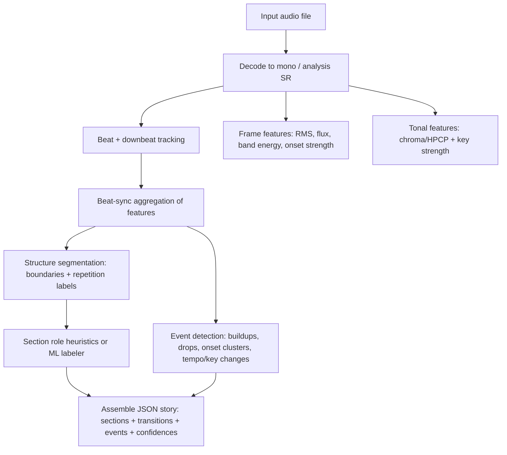

> **Historical research.** Actual implementation uses librosa SSM + custom novelty + role-based labels. See `songviz/story.py`.

# Building a JSON “song story” from audio using free and open-source tools

## Executive summary

A “song story” (sections + energy dynamics + events) is not a single solved problem: it is a **pipeline** that combines (a) *structural segmentation* (where the sections/boundaries are), (b) *beat/tempo and tonality tracking* (how rhythm/key evolve), (c) *energy and salience features* (what “builds up” or “drops”), and optionally (d) *instrumentation inference* (what sound sources change). Most free/open-source tools do **well at boundaries and similarity labels (A/B/C)** but generally do **not** reliably output semantic roles (“verse/chorus/bridge”) without additional heuristics or a supervised model trained for that purpose. This is explicitly acknowledged by established segmenters (they “identify similar segments” but do not label them as chorus, etc.). citeturn17view0

Unspecified details that materially affect performance include: target genre(s), whether the input is a mastered full mix or stems, the desired granularity (section vs phrase), and whether you need *functional* labels (“verse/chorus”) or are satisfied with structural labels (A/B repetitions). This report provides defensible defaults and tuning guidance for common pop/EDM workflows.

For most users who want an implementable, offline, open pipeline that produces JSON, the strongest default is:

**Recommended default pipeline (most users):**
- **MSAF** for section boundaries + similarity clustering (A/B/…) (MIT license). citeturn9view0turn14search1  
- **Essentia music extractor or selective Essentia algorithms** for time-varying rhythm/tonal/energy descriptors (AGPLv3; good for research/prototyping and non-commercial use per project licensing guidance). citeturn3search0turn8view0turn3search12  
- **madmom** for robust beats/downbeats and onset salience (BSD for source; models have separate licensing notes). citeturn6search22turn3search1turn7search3  
- Optional: **musicnn** (ISC) or **OpenL3** (MIT code; CC BY 4.0 weights) to infer instrumentation/timbre changes per section. citeturn2search18turn4search1  

This combination yields boundaries, beat-aligned features, tonality, energy curves, and event salience; you then export a JSON story with confidence scores based on novelty peak salience, model probabilities (where available), and heuristic consistency checks.

## Tool landscape and comparison

### Prioritized tool list for “song story” extraction

The ordering below prioritizes: end-to-end usefulness for producing *structured metadata*, breadth of features, stability across genres, and batch/automation readiness.

**Highest leverage structural + story building blocks**
- **MSAF (Music Structure Analysis Framework)**: multi-algorithm structural segmentation + label clustering + evaluation tooling, designed specifically for music structure research. citeturn0search2turn14search10turn3search14  
- **Essentia (C++/Python)**: large MIR feature library with rhythm descriptors, tonal extractors (key/chords/HPCP), loudness/energy features, and a configurable CLI extractor that outputs JSON. citeturn3search0turn8view0turn5search11  
- **librosa + scikit-learn**: widely used Python stack; includes recurrence matrices and an implemented “Laplacian segmentation” example based on McFee & Ellis (2014). citeturn2search0turn2search8turn3search2  
- **madmom**: strong onset/beat/downbeat pipelines, including RNN/DBN trackers (useful for tempo dynamics, drop timing, beat-synchronous aggregation). citeturn6search22turn7search3turn6search3  
- **Sonic Annotator + Vamp plugins**: batch host for Vamp feature extractors; good for segmentation, key, tonal change, beat, onset, etc., exporting CSV/RDF for downstream JSON conversion. citeturn2search7turn2search3turn17view0  

**Optional “instrumentation/timbre change” add-ons**
- **musicnn**: pretrained music tagging networks (includes instrument tags) for coarse instrumentation inference per time window or per segment. citeturn2search18  
- **OpenL3**: deep audio embeddings you can cluster/change-detect over time; code MIT, weights CC BY 4.0. citeturn4search1  

**Scaling/engineering helper**
- **Annoy** by entity["company","Spotify","music streaming company"]: fast approximate nearest neighbors for building recurrence/self-similarity graphs at scale (useful if you compute embeddings per beat and need kNN quickly). citeturn13search0  

### Comparison table

Capability scores are qualitative (“✓” = supported directly; “△” = achievable via common pipeline glue; “—” = not typical). “Section labeling” here means *A/B clustering or functional labels*; most tools reliably provide A/B-type repetition labels but not verse/chorus names.

| Tool | Primary purpose | License | Inputs | Outputs | Dependencies | Ease of use | Section boundaries | Similarity labels (A/B) | Functional labels (verse/chorus) | Beat/tempo/downbeat | Key/tonality | Energy/“build” features | Instrumentation changes | Notes on reliability for buildups/drops |
|---|---|---|---|---|---|---|---|---|---|---|---|---|---|---|
| MSAF | Music structure segmentation + evaluation | MIT citeturn9view0turn0search2 | Audio files | Boundaries + labels; MIREX format writer citeturn14search1 | Python, NumPy stack | Medium | ✓ | ✓ | △ (heuristics needed) | △ (via beat sync option + external beat trackers) citeturn6search6turn14search1 | △ | △ | △ | Best “structure backbone”; pairing with beat/energy features makes drop/buildup detection feasible. |
| Essentia | Broad MIR features + ready CLI extractor | AGPLv3 citeturn3search0turn3search12 | Many codecs; CLI resamples and mixes to mono citeturn8view0 | JSON/YAML pools; rich descriptors citeturn5search11turn8view0 | C++ core; Python bindings | High (CLI), Medium (API) | △ (SBic exists; also use MSAF) citeturn6search1 | △ | △ | ✓ (beats, onset rate, bpm; beat loudness) citeturn8view0turn5search1turn5search2 | ✓ (KeyExtractor/TonalExtractor) citeturn4search3turn5search2 | ✓ (EBU loudness, RMS, spectral flux, bands) citeturn8view0 | △ (via embedded ML models and external taggers) | Excellent for energy curves and “event” proxies (spectral flux, onset rate, low-band energy). |
| librosa + scikit-learn | Feature extraction + segmentation recipes | ISC (librosa) citeturn2search1turn2search8 | Many codecs (via soundfile/audioread) | Arrays; you export JSON | Python scientific stack | High | ✓ (Laplacian segmentation example) citeturn2search8turn3search2 | ✓ (via clustering) | △ (heuristics/supervised model) | ✓ (beat_track) citeturn2search1turn2search13 | △ (chroma-based key; better via Essentia/QM) | ✓ (RMS, flux etc. via features) | △ (via taggers/embeddings) | Very flexible; your success depends on your feature design and tuning. |
| madmom | Beats/downbeats/onsets (MIR-focused) | BSD for source (models separate) citeturn3search1turn6search22 | Audio files | Beat/downbeat times, activation functions | Python; some models | Medium | — | — | — | ✓ (RNN + DBN) citeturn6search22turn7search3 | — | △ (onset density proxies) | — | Fantastic for “what is happening rhythmically” and for synchronizing story to beats/bars. |
| Sonic Annotator + QM Vamp plugins | Batch feature extraction via plugins | GPL-2.0 (host) citeturn2search7 | Wide audio support | CSV/RDF citeturn2search3turn15search1 | Vamp plugin install | Medium | ✓ (qm-segmenter) citeturn17view0 | ✓ (segment types) | — (explicitly not functional labels) citeturn17view0 | ✓ (qm-tempotracker, qm-barbeattracker) citeturn16view0 | ✓ (qm-keydetector, qm-tonalchange) citeturn16view0turn17view0 | △ | △ | Strong “classic MIR” pipeline; good when you want compiled plugins + stable CSV outputs. |
| musicnn | Music audio tagging (instrument/mood/genre) | ISC citeturn2search18 | Audio files | Tag probabilities | Python + DL runtime | Medium | — | — | — | — | — | △ (energy as a tag correlate) | ✓ | Use as instrumentation/spin changes; works best with segment-level aggregation. |
| OpenL3 | Deep audio embeddings | MIT code; CC BY 4.0 weights citeturn4search1 | Audio files | Embedding sequences | Python + DL runtime | Medium | △ (via change detection on embeddings) | △ | — | — | — | △ | ✓ (as “timbre state” embeddings) | Useful for detecting “something changed” even when you don’t know what instrument it is. |
| Essentia.js demos | In-browser feature extraction | Open-source (JS/WASM; tied to Essentia) citeturn7search19turn7search2 | Browser audio upload | Feature readouts in web | Browser | High | — | — | — | △ | △ | ✓ | — | Best open-source web option for quick descriptor checking without local install. |
| “Free web analyzers” (proprietary) | Usually key/BPM/energy/structure claims | Proprietary | Upload audio | Web UI | None local | High | △ | — | — | △ | △ | △ | — | Examples exist, but treat as black boxes; consider privacy and reproducibility. citeturn7search1turn7search5turn7search4 |

## Methods that underpin “song story” extraction

### Structural segmentation and section similarity

A practical “story map” usually begins with a **self-similarity / recurrence representation** and then turns it into boundaries and (optionally) repeating labels.

- **Recurrence / self-similarity matrix (SSM)**: Compute a feature vector per frame or per beat (e.g., chroma/HPCP, MFCC, embeddings) and connect each time point to its k-nearest neighbors to form a recurrence matrix. librosa provides a canonical recurrence matrix implementation and documents the neighbor/width controls that directly shape recurrence structure. citeturn2search0  
- **Novelty-based boundary detection (Foote-style)**: Boundaries correspond to local peaks in a novelty function derived from self-similarity. This approach is widely taught and directly references Foote’s novelty principle for audio segmentation. citeturn4search8turn4search12  
- **Spectral graph / Laplacian segmentation (McFee & Ellis)**: Build an affinity matrix (often from recurrence), compute graph Laplacian eigenvectors, and cluster/partition them to obtain boundaries (and optionally hierarchical levels). librosa’s “Laplacian segmentation” example implements this method, based on the original ISMIR paper. citeturn2search8turn3search2  
- **MSAF as a “structure workbench”**: MSAF packages multiple boundary algorithms (including spectral clustering methods) and label clustering algorithms, plus datasets and evaluation routines, specifically for structure research and comparisons. citeturn0search22turn14search10turn14search1  
- **Classic HMM/cluster-based segmenters** (Vamp QM Segmenter): The QM segmenter uses timbral similarity features, PCA, then HMM and clustering to assign “segment types.” It explicitly aims at discovering repeated types and does not assign semantic labels like “chorus.” citeturn17view0  

image_group{"layout":"carousel","aspect_ratio":"16:9","query":["music self similarity matrix structural segmentation visualization","audio novelty function segmentation peak detection plot","beat tracking downbeat detection visualization","spectral graph theory laplacian music segmentation diagram"],"num_per_query":1}

**What this buys you for “buildups/drops”**  
Pure structure algorithms find section boundaries and repetitions; they do not inherently know what a buildup is. Buildups/drops are better detected by combining boundaries with **energy and onset-density trajectories** (see below), then classifying transitions between adjacent sections.

### Beat/tempo, onset salience, and timing grids

For a story you often want **bars/beats** so that section boundaries and event times can be aligned to musical time (e.g., “drop at bar 33”).

- **Beat tracking (librosa)**: `beat_track` uses onset strength, tempo estimation from onset correlation, and dynamic programming peak picking (documented in the API, including parameters that you’ll tune for different genres). citeturn2search1turn2search13  
- **Beats/downbeats and onset activation (madmom)**: madmom is explicitly built for MIR tasks and includes state-of-the-art onset detection and beat/downbeat tracking in its research-era design. citeturn6search22turn6search3turn7search3  
- **Vamp plugin alternatives (QM tempo/bar trackers)**: QM Vamp plugins expose tempo/beat and bar/beat trackers as compiled plugins with stable identifiers. citeturn16view0turn17view0  

**Tempo change detection**  
Most trackers output either a global tempo or beat times. For tempo change “events,” compute a local tempo curve from beat-to-beat IOIs (inter-onset intervals) and then segment it (e.g., piecewise constant / change-point detection). Beat trackers will struggle when the music is rubato or has long beatless intros; you should treat beat confidence and onset density as inputs to confidence scoring.

### Energy dynamics and “build”/“drop” evidence

Energy is not just loudness; for EDM drops you often need low-frequency energy and onset density as well.

Essentia’s music extractor documents a rich set of time-domain and spectral descriptors directly useful for energy/event modeling: EBU R128 loudness descriptors, RMS, spectral flux, energy bands (low/mid/high), dynamic complexity, onset rate, beat loudness, etc. citeturn8view0

Useful ingredient features:
- **Short-time RMS / spectral RMS** as an energy envelope proxy. citeturn8view0  
- **Spectral flux** as change/salience proxy (useful for buildup intensity and transitions). citeturn8view0  
- **Energy-band splits (e.g., 20–150 Hz)** to detect bass/kick entry typical of “drops.” citeturn8view0  
- **Onset rate / onset clusters**: Essentia provides onset_rate in the extractor; madmom provides onset activation functions and peak-picking pipelines. citeturn8view0turn6search3turn6search7  
- **Beat loudness and beat-band ratios**: beat-synchronous spectral energy features can better match perceived “energy” changes than framewise RMS. citeturn8view0  

**Strengths/weaknesses for buildup/drop detection**
- Good: Detecting **sudden** transitions (drops) is feasible with energy derivative + low-band energy jump + onset density change, especially aligned to bar boundaries.
- Hard: Detecting **gradual crescendos** is ambiguous; many genres build without a drop, and mixing/mastering choices (compression, limiting) can flatten energy profiles, reducing contrast.

### Tonality, key, and harmonic change

Key changes and tonal transitions can be significant “story” events or visual mood cues.

- **Essentia KeyExtractor** computes HPCP frames and applies key estimation; it provides tuning correction options and a key strength. citeturn4search3turn5search2  
- **QM Vamp Key Detector / Tonal Change** continuously estimates key changes via chromagram correlation and provides a “tonal change detection function” and change positions; the docs include parameters controlling how eager the detector is (window length / smoothing), which you can use to avoid over-triggering. citeturn16view0turn17view0  

### Instrumentation and timbre changes

Fully accurate instrument recognition from a full mix is not solved, but you can get usable signals:

- **Tagging models (musicnn)** output probabilities over tags (including instruments), enabling coarse measurement like “strings probability rose sharply in chorus.” citeturn2search18turn2search6  
- **Embeddings (OpenL3)** provide a general-purpose representation; you can detect change points in embedding space even when you can’t name the instrument. citeturn4search1  

## Practical pipelines to generate a JSON story

### A robust default pipeline and tuning guidance

**Preprocessing defaults (genre-agnostic)**
- Convert to mono, preserve headroom, and avoid aggressive normalization if you care about dynamics; alternatively, normalize for comparability across tracks. The Essentia CLI extractor documents that it sums to mono and normalizes using replay gain. citeturn8view0  
- Use a consistent analysis sample rate. Essentia’s extractor recommends and defaults to 44100 Hz, and provides separate frame/hop defaults for low-level and tonal features. citeturn8view0  
- If the track begins with silence or has long ambience, consider trimming silence before beat/structure analysis; otherwise you may get spurious “intro” boundaries.

**Feature extraction defaults (good starting points)**
- Rhythm grid: beats + downbeats, with a confidence estimate if available (madmom/QM/Essentia rhythm extractor). citeturn6search22turn16view0turn8view0  
- Energy curves: RMS, spectral flux, and low-band energy (20–150 Hz) at ~10–50 ms resolution, aggregated to beat level. citeturn8view0  
- Tonality: HPCP/chroma per beat; run key estimation in sliding windows (e.g., 8–16 beats) to detect modulations, using key strength to suppress uncertain changes. citeturn4search3turn16view0  
- Structure: obtain a coarse segmentation (6–12 unique segment types is a common practical range), and optionally a finer segmentation for phrase-level events.

**Default segmentation configuration (practical)**
- If using MSAF scluster: start with beat-synchronous PCP/HPCP features; MSAF exposes spectral clustering boundary retrieval aligned to McFee & Ellis methods. citeturn6search6turn3search2  
- If using QM Segmenter: use the default “Hybrid” feature type for modern studio recordings; tune minimum segment duration upward (e.g., 6–10 s) when you want sections rather than micro-changes. citeturn17view0  

### Pipeline flowchart



### Example JSON schema and sensible defaults

This is a practical schema for video generation. It supports multiple segmentation “views” (coarse vs fine), uncertainty, and beat alignment.

```json
{
  "meta": {
    "title": null,
    "duration_sec": 0.0,
    "analysis_sr_hz": 44100,
    "hop_sec": 0.02322,
    "tools": {
      "structure": {"name": "msaf+scluster", "version": null},
      "beats": {"name": "madmom", "version": null},
      "features": {"name": "essentia", "version": null},
      "tags": {"name": "musicnn", "version": null}
    }
  },
  "timebase": {
    "beats_sec": [],
    "downbeats_sec": [],
    "tempo_bpm_local": []
  },
  "sections": [
    {
      "id": "S1",
      "t0": 0.0,
      "t1": 12.34,
      "label_struct": "A",
      "label_func": "intro",
      "confidence": 0.72,
      "energy": {"level": "low", "rms_z": -1.2, "lufs_short": -18.4},
      "tonality": {"key": "C", "mode": "major", "strength": 0.61},
      "tags": {"drums": 0.2, "synth": 0.7, "guitar": 0.1}
    }
  ],
  "transitions": [
    {
      "t": 45.67,
      "type": "drop",
      "from_section": "S3",
      "to_section": "S4",
      "confidence": 0.83,
      "evidence": {
        "lowband_energy_jump": 2.1,
        "onset_rate_jump": 0.8,
        "bar_aligned": true
      }
    }
  ],
  "events": [
    {"t": 30.12, "type": "key_change", "value": "E minor", "confidence": 0.55},
    {"t": 61.00, "type": "tempo_change", "value": 128.0, "confidence": 0.66},
    {"t": 75.20, "type": "onset_cluster", "value": {"density": 9.2}, "confidence": 0.78}
  ]
}
```

### Step-by-step usage examples for four practical pipelines

#### Essentia pipeline (feature spine + JSON output)

**Why it’s top-tier for story building**  
The `essentia_streaming_extractor_music` CLI is explicitly designed to compute a large set of spectral, rhythm, tonal, and high-level descriptors, and it supports JSON output and configuration via YAML profiles. citeturn8view0  

**Install**
- Use the prebuilt binaries or build/install via Python bindings (varies by OS). The extractor is distributed as part of Essentia releases; the docs describe it as the easiest way to get descriptors without programming. citeturn8view0turn3search0  

**Run (default profile, JSON output)**
```bash
essentia_streaming_extractor_music input.wav output.json
```

**Recommended profile edits for “story”**
- Keep `analysisSampleRate: 44100.0` (the docs recommend 44100). citeturn8view0  
- Enable frame outputs if you want time-varying curves: set `outputFrames` to 1 (trade-off: larger output). citeturn8view0  
- Ensure rhythm limits cover your genres: defaults include `minTempo: 40`, `maxTempo: 208`. citeturn8view0  
- Use energy-band splits and onset_rate as event evidence; these descriptors are explicitly included. citeturn8view0  

**Parse to story JSON (Python sketch)**
- Read Essentia’s JSON pool, extract:
  - `rhythm.beats_position`, `rhythm.bpm`, `rhythm.onset_rate`, `rhythm.beats_loudness_*` citeturn8view0  
  - `lowlevel.spectral_rms`, `lowlevel.spectral_flux`, `lowlevel.spectral_energyband_low` citeturn8view0  
  - `tonal.key_*`, `tonal.hpcp_*` (or compute sliding keys with KeyExtractor) citeturn5search2turn4search3  

Then compute:
- Energy level per section via quantiles (e.g., bottom third = low, middle = medium, top = high).
- Drop candidates where low-band energy and beat loudness jump sharply at a bar boundary.

#### madmom pipeline (beats/downbeats/onsets for timing and “events”)

**Why it’s essential**  
madmom is designed for MIR workflows and includes state-of-the-art onset detection and beat/downbeat tracking in the library and in published documentation. citeturn6search22turn3search25  

**Install**
```bash
pip install madmom
```

**Python: downbeats + beats**
```python
from madmom.features.downbeats import RNNDownBeatProcessor, DBNDownBeatTrackingProcessor

act = RNNDownBeatProcessor()( "input.wav" )
proc = DBNDownBeatTrackingProcessor(beats_per_bar=[3,4], fps=100)
beats = proc(act)   # columns: time, beat_position_in_bar
```
Downbeat/beat processors are part of madmom’s beat/downbeat modules. citeturn7search3turn0search5  

**Python: onset activation + onset times**
```python
from madmom.features.onsets import RNNOnsetProcessor, OnsetPeakPickingProcessor

act = RNNOnsetProcessor()( "input.wav" )
onsets = OnsetPeakPickingProcessor(fps=100)(act)
```
madmom documents multiple onset processors and peak picking workflows. citeturn6search7turn6search15  

**Use in story JSON**
- Use downbeats to quantize structural boundaries and drops to bars.
- Use onset density spikes (“onset clusters”) as events; for buildups, look for sustained increases in onset density over multiple bars.

#### librosa + scikit-learn pipeline (structure + energy in pure Python)

**Why it’s valuable**  
librosa provides the primitives for recurrence matrices and beat tracking, plus a fully worked “Laplacian segmentation” example implementing McFee & Ellis (2014). citeturn2search0turn2search8turn2search1  

**Install**
```bash
pip install librosa scikit-learn
```

**Core structure steps (conceptual code outline)**
```python
import numpy as np
import librosa
from sklearn.cluster import KMeans

y, sr = librosa.load("input.wav", sr=22050, mono=True)

# Beat grid
tempo, beat_frames = librosa.beat.beat_track(y=y, sr=sr, hop_length=512)

# Feature for structure (e.g., chroma or MFCC), beat-synced
chroma = librosa.feature.chroma_cqt(y=y, sr=sr, hop_length=512)
chroma_sync = librosa.util.sync(chroma, beat_frames)

# Recurrence matrix (self-similarity)
R = librosa.segment.recurrence_matrix(chroma_sync, mode="affinity", sym=True)

# Laplacian segmentation: embed + cluster (see librosa example)
# Then derive boundaries from cluster changes.
```
Recurrence matrix behavior is defined in the librosa API, including `k` and `width` neighbor constraints. citeturn2search0  
Beat tracking stages and tuning parameters are documented in the beat tracking API. citeturn2search1  
The Laplacian segmentation approach and reference to McFee & Ellis (2014) are in the example notebook. citeturn2search8turn3search2  

**Energy + buildup/drop heuristics**
- Compute RMS and its derivative; compute low-frequency energy (e.g., mel bands restricted to bass region) and its derivative.
- Define:
  - `buildup` = sustained positive slope over N beats AND rising onset strength.
  - `drop` = large step increase in low-band energy (and/or beat loudness proxy) at a downbeat.

#### Sonic Annotator + Vamp pipelines (compiled classic MIR features → CSV → JSON)

**Why it’s useful**  
Sonic Annotator is a batch tool that runs installed Vamp plugins and writes results in RDF or comma-separated formats. citeturn2search3turn15search1  

**Install**
- Install Sonic Annotator (binary or package, OS-dependent). The official project is maintained on GitHub and vamp-plugins.org. citeturn2search7turn2search3  
- Install a plugin pack, especially **QM Vamp plugins**, which include onset, beat, bar/beat, key, tonal change, and a segmenter. citeturn16view0turn15search20  

**Extract structural segments**
QM Segmenter identifier and output are documented; it returns boundaries with segment-type numbers and explicitly does not label “chorus.” citeturn17view0  
```bash
sonic-annotator -d vamp:qm-vamp-plugins:qm-segmenter:segmentation input.wav -w csv --csv-stdout > segments.csv
```

**Extract beats and bars**
```bash
sonic-annotator -d vamp:qm-vamp-plugins:qm-barbeattracker:beats input.wav -w csv --csv-stdout > bars_beats.csv
```

**Extract key changes and tonal changes**
The QM Key Detector continuously estimates key and provides key change events; Tonal Change provides a detection function and change positions. citeturn16view0turn17view0  
```bash
sonic-annotator -d vamp:qm-vamp-plugins:qm-keydetector:key input.wav -w csv --csv-stdout > key_changes.csv
sonic-annotator -d vamp:qm-vamp-plugins:qm-tonalchange:tonalchangepositions input.wav -w csv --csv-stdout > tonal_changes.csv
```

**Extract onsets**
```bash
sonic-annotator -d vamp:qm-vamp-plugins:qm-onsetdetector:onsets input.wav -w csv --csv-stdout > onsets.csv
```

**Important tuning guidance**
- QM Tonal Change docs recommend increasing Gaussian smoothing above the short default to reduce meaningless micro-changes. citeturn16view0turn17view0  
- QM Segmenter offers a minimum segment duration parameter; raising it helps focus on musical sections instead of timbral micro-events. citeturn17view0  

**Convert CSV → JSON story**
- Parse each CSV as (time, value) events.
- Build a unified timebase (beats/downbeats).
- Snap segment boundaries to nearest downbeat if within tolerance (e.g., ≤0.5s).
- Compute per-segment energy from RMS/flux (from Essentia/librosa) or from the segmenter’s stored energy envelope concept (if available in your features), then label low/medium/high by quantiles.

## Evaluation and failure modes

### Known failure modes

- **Over-segmentation**: too many boundaries triggered by production changes (fills, risers, breakdown FX) rather than true sections. This is common for novelty/flux methods without minimum-duration constraints.
- **Under-segmentation**: long sections merged when instrumentation changes subtly but harmony/rhythm remain consistent.
- **EDM drops and remix structure**: repeated “build → drop” cycles can confuse repetition-based labeling, especially when each drop has different sound design but same rhythmic template.
- **Gradual crescendos**: boundaries may be fuzzy; multiple plausible placements exist.
- **Stems vs full mix**: stems often make boundaries clearer; full mixes can hide changes under consistent drums/bass.

The QM Segmenter documentation itself emphasizes similarity-based types, not functional roles, and warns it processes substantially after ingesting full audio. citeturn17view0

### Metrics and how to measure them

For structure, mir_eval provides standardized segment boundary and structure metrics:

- **Boundary detection precision/recall/F-measure** with a tolerance window (e.g., 0.5s). citeturn1view0  
- **Boundary deviation**: median absolute time difference reference→estimate and estimate→reference. citeturn1view0  
- **Over-/under-segmentation measures** via conditional entropy (NCE) and clustering-style metrics (Rand index, adjusted Rand, V-measure). citeturn1view0  

**Minimal evaluation script skeleton (mir_eval)**
```python
import mir_eval
import numpy as np

# Each is shape (n,2): [start,end] for each interval
ref_intervals, ref_labels = mir_eval.io.load_labeled_intervals("ref.lab")
est_intervals, est_labels = mir_eval.io.load_labeled_intervals("est.lab")

P, R, F = mir_eval.segment.detection(ref_intervals, est_intervals, window=0.5, trim=True)
r_to_e, e_to_r = mir_eval.segment.deviation(ref_intervals, est_intervals, trim=True)

# Structural (label-based) metrics
pairP, pairR, pairF = mir_eval.segment.pairwise(ref_intervals, ref_labels, est_intervals, est_labels)
ari = mir_eval.segment.ari(ref_intervals, ref_labels, est_intervals, est_labels)
```
mir_eval documents these functions, their inputs, and their interpretation. citeturn1view0turn4search6  

### Benchmark datasets and practical tests you can run

**Public structure datasets (for repeatable benchmarking)**
- **SALAMI**: large-scale structural annotations dataset; public data is on GitHub and accompanied by an ISMIR paper describing the dataset design. citeturn12search0turn12search16turn12search4  
- **Harmonix Set**: includes beats/downbeats and functional segmentation for 900+ tracks (useful if you care about verse/chorus-style roles). citeturn12search1  
- MSAF ships datasets and points to dataset resources for structure research. citeturn0search6turn12search10  

**Small labeled tests on your own audio (recommended)**
- Pick 3–5 songs in your target genre, and create a “gold” annotation with:
  - coarse sections (intro/verse/chorus/bridge/outro),
  - drop points (if applicable),
  - key change points (if obvious),
  - tempo change points (if present).
- Keep it small (5–10 minutes of audio total) so you can iterate quickly.

**Exact commands/workflow for a basic benchmark**
1. Run your pipeline to produce `est.lab` (segment intervals + labels).
2. Create `ref.lab` with the same format.
3. Evaluate with mir_eval `segment.detection` and `segment.deviation` using windows (0.5s and 3s are common reference points in documentation examples). citeturn1view0  

## Integration guidance and recommended default

### Integration tips for video generation workflows

**Schema strategy**
- Store multiple structural interpretations in parallel:
  - `structure_coarse` (6–10 sections),
  - `structure_fine` (phrase-level),
  - `events` (drops, builds, key/tempo changes).
- Keep `confidence` on every boundary/event and retain raw evidence (energy jump, onset density jump, novelty peak).

**Mapping music signals to visuals**
- **Energy level (low/medium/high)** → cut rate, camera motion, particle density, brightness, vignette strength.
- **Beat grid** → frame-accurate motion sync (e.g., animate on every beat; emphasize downbeats with bigger transforms). madmom and QM bar/beat trackers are designed for this purpose. citeturn7search3turn16view0  
- **Key/tonality cues** → color palette or hue shift; modulations can trigger palette transitions. Essentia KeyExtractor and QM Key Detector provide key estimates and strengths you can use to avoid jitter. citeturn4search3turn16view0  
- **Instrumentation changes** → change visual motif (e.g., new “character” for strings vs drums) using tag probabilities or embedding change points. citeturn2search18turn4search1  

**Practical handling of ambiguity**
- When two segmentations disagree (common), prefer:
  - boundaries that align to downbeats,
  - boundaries with high novelty salience,
  - repeated-type segments for “chorus candidate” identification,
  - avoid micro-boundaries shorter than your minimum segment duration (e.g., 6–10s) unless you explicitly want phrase-level stories.

### Best default recommendation and alternatives

**Best default for most users**
- **MSAF + Essentia + madmom** as described in the executive summary:
  - MSAF supplies boundaries and repetition labels in a research-backed framework. citeturn14search1turn3search14  
  - Essentia supplies energy, rhythm, and tonal descriptors, with CLI JSON export and documented default parameters. citeturn8view0turn5search11  
  - madmom supplies strong beats/downbeats/onsets for timing and event salience. citeturn6search22turn7search3  

**Alternatives by need**
- **Fast pure-Python prototyping**: librosa + scikit-learn Laplacian segmentation + your own feature design. citeturn2search8turn2search0  
- **“No Python, compiled features, stable CSV”**: Sonic Annotator + QM Vamp plugins (segments, key changes, tonal changes, beats, onsets) and convert CSV to JSON. citeturn15search1turn17view0  
- **EDM-heavy beat accuracy / modern beat trackers**: consider BeatNet or beat_this as beat/downbeat alternatives (open repositories; includes an online demo notebook for quick testing). citeturn0search21turn7search6  
- **Web-based quick checks (open-source)**: Essentia.js interactive demos offer descriptor extraction directly in the browser. citeturn7search2turn7search19  

**Note on free web analyzers**
There are free online key/BPM/“energy” analyzers, but they are typically proprietary black boxes; use them only for quick sanity checks and do not rely on them for reproducible pipelines or privacy-sensitive audio. citeturn7search1turn7search5turn7search4