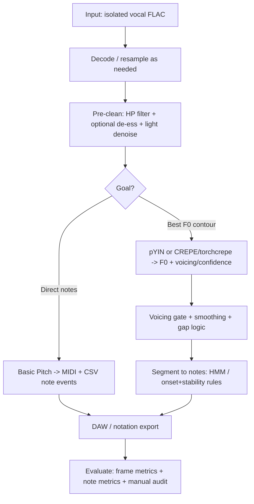

> **Reference for Phase 4 (vocal note events).** pYIN is implemented; Basic Pitch is optional. See `docs/06_reduced_representation.md`.

# Extracting Sung Pitch and Notes from Isolated Vocal FLAC with Free and Open-Source Tools

## Executive summary

You have an isolated vocal track (FLAC) produced by a separation tool (“DMux”; likely a entity["company","Meta","parent of facebook"] Demucs-family workflow). In this setting, the core problem is **monophonic fundamental frequency (F0) tracking plus reliable voiced/unvoiced decisions**, not “predominant melody in a mix.” This is good news: you can choose tools optimized for monophonic voice and explicitly suppress consonant noise (e.g., /s/, /t/) by tuning voicing thresholds and post-processing. The trade-off is that separation artifacts and reverb can still “simulate polyphony,” which breaks periodicity-based trackers. citeturn13view0turn26view2turn24search7

Best overall practical recommendation (free/open-source, high accuracy, vocal-friendly, outputs usable note events):
- **Best “one command” to notes (MIDI + CSV): Basic Pitch** (Apache-2.0) from entity["company","Spotify","music streaming company"]. It **accepts FLAC**, resamples internally, and outputs **MIDI with pitch bends** and optional **note-events CSV**. It also exposes onset/frame thresholds and optional post-processing (“melodia_trick”) in its Python API, which helps with consonant-heavy passages. citeturn8view0turn19search0turn27view0turn19search4turn18search7  
- **Best “vocal-first” monophonic pitch + note tracking with controllable voicing: pYIN** (GPL) via Vamp or via `librosa.pyin`. pYIN explicitly models multiple pitch candidates and uses **HMM + Viterbi decoding** to produce a smoothed pitch track **and voicing flags**, which is exactly what you need when consonants create unvoiced gaps. citeturn11search0turn16search3turn26view2turn26view0turn13view0  
- **Best widely-validated deep-learning F0 contour extractor: CREPE / torchcrepe** (MIT). CREPE outputs **time, frequency (Hz), confidence** and supports **Viterbi smoothing**, which you can use to suppress consonant artifacts by thresholding confidence and then segmenting into notes. citeturn9view0turn14search20turn14search2turn17search0

If your primary goal is “most accurate F0 on human singing” and you’re willing to manage model weights, RMVPE is frequently cited as strong for vocal pitch in polyphonic conditions, but practical open distribution of pretrained weights can be less clear than the tools above. Treat it as an **advanced alternative** rather than the default. citeturn14search4turn24search7turn21view0turn24search2turn15search12

## Tool and library landscape

### Ranking of candidate tools for isolated vocals

Because your input is already (mostly) monophonic, the most important properties are: (a) voicing detection quality (how well unvoiced consonants are treated as “no pitch”), (b) stability under vibrato/glides, (c) robustness to separation artifacts, and (d) ability to emit note events (not just an F0 curve). The shortlist below prioritizes **accuracy on vocals** and **utility for “note extraction.”** citeturn13view0turn27view0turn9view0turn11search0turn29search0

**High-confidence “top tier” for your use case**
- **Basic Pitch**: best end-to-end *audio → notes* with open license and FLAC support; strong for singing because it supports pitch bends and returns note events directly. citeturn8view0turn27view0turn18search7turn19search4  
- **pYIN (Vamp / librosa)**: best classic monophonic vocal pitch tracking when you need explicit voicing control and HMM smoothing; also can emit note events (Vamp `notes` output). citeturn11search0turn16search3turn26view0turn26view2  
- **CREPE / torchcrepe**: best widely-used deep monophonic F0 contour; confidence output + Viterbi smoothing are effective levers for consonant suppression. citeturn9view0turn14search2turn17search0turn14search20

**Strong supporting tools (often used in real workflows)**
- **Praat / Parselmouth**: very mature speech/vocal pitch tracking; includes explicit voicing thresholds and multiple pitch analysis modes; good sanity-check baseline and often fast. citeturn10search2turn10search26turn10search34  
- **Sonic Visualiser + Sonic Annotator + Vamp plugins**: a practical ecosystem for running pitch/note extractors, exporting (CSV, MIDI from note layers), and auditing results. citeturn7search6turn7search9turn15search3turn15search19turn7search14  
- **aubio**: quick CLI pitch and note extraction; useful baseline, but tends to be less accurate on expressive singing than pYIN/CREPE unless heavily tuned. citeturn1search25turn10search3turn28search3turn10search15

**Advanced / research-grade**
- **RMVPE**: state-of-the-art claims for vocal pitch estimation in polyphonic music; relevant even for isolated vocals when artifacts remain, but you must confirm weight provenance/licensing in your pipeline. citeturn14search4turn24search7turn21view0turn24search2  
- **PENN**: open-source neural pitch + periodicity estimators, positioned as a general neural alternative to classic trackers. citeturn15search0turn15search16  
- **Essentia**: broad MIR library including probabilistic YIN and a CREPE wrapper, but licensing is AGPLv3 for “open/non-commercial” use and may trigger copyleft concerns in some deployments. citeturn11search3turn14search3turn17search3

### Comparison table

The table focuses on your requested dimensions: **accuracy orientation**, license, formats, outputs, and consonant-handling notes.

| Tool / library | What it gives you | Vocal accuracy orientation | Key consonant-handling lever | Inputs | Outputs | License | Notes for your case |
|---|---|---|---|---|---|---|---|
| Basic Pitch | Note events + MIDI (with pitch bends), optional CSV note events and NPZ model outputs | Strong practical AMT; designed to generalize across instruments incl. voice | Tune onset/frame thresholds; optional post-processing (“melodia_trick”) | Many codecs incl. FLAC; resamples to 22050; mono mixdown | `.mid`, `.csv` note events, `.npz`, optional `.wav` sonification | Apache-2.0 | Best “fast path” to notes; remains sensitive to separation chatter; use thresholds/gating. citeturn8view0turn27view0turn19search4turn18search7 |
| CREPE (TensorFlow) | F0 (Hz) per frame + confidence | Monophonic pitch tracking; “state-of-the-art (as of 2018)” claim | Confidence threshold + optional `--viterbi`; adjust step size | WAV only; internally resamples to 16 kHz; hop default 10 ms | `*.f0.csv` (time, Hz, confidence) | MIT | Excellent contour; you must add note segmentation yourself. citeturn9view0turn14search20turn17search1 |
| torchcrepe (PyTorch) | F0 + periodicity + (optionally) Viterbi decoding | CREPE-family; convenient for Python pipelines | Viterbi decoding penalizes large pitch jumps | Audio arrays (your loader) | Arrays; you decide export formats | MIT | Often easier than TF CREPE; still needs note segmentation. citeturn14search2turn17search0 |
| pYIN (Vamp plugin) | Smoothed F0 + voiced probability + note events | Designed for monophonic harmonic sources like voice | Voiced-prob output; “low amplitude suppression”; duration pruning; onset sensitivity | Whatever host supports (often WAV) | Dense F0, voiced prob, sparse note events (Hz) | GPL | Very strong consonant robustness because unvoiced frames can be dropped; beware reverb/polyphony failure modes. citeturn26view0turn26view2turn13view0 |
| `librosa.pyin` | F0 + voiced flag + voiced probabilities | Reference pYIN implementation used widely | `voiced_probs` threshold; `fmin/fmax`; `fill_na` | Many codecs via librosa/audioread; resampling as you choose | Arrays; you export | ISC | Great for scripting; pYIN’s HMM-based voicing is highly relevant to consonants. citeturn16search3turn16search27turn17search2 |
| Tony (GUI) | Pitch track + note track with correction tools | Explicitly designed for solo vocal recordings | Manual correction + alternate pitch track selection | Common audio files; resamples to 44.1k internally | CSV export (pitch + notes) | GPL-2.0 | Best when you can interactively fix consonant glitches; official export is CSV. citeturn4view0turn4view2turn4view1 |
| Sonic Annotator | Batch runner for Vamp plugins | Depends on the plugin you run | Use pYIN’s voiced prob and parameters | Audio files supported by host stack | CSV, RDF, etc. | GPL-2.0 | Best batch glue for pYIN notes/F0 and other Vamp features. citeturn15search3turn15search19turn11search6 |
| Praat / Parselmouth | Pitch contour with voicing controls | Speech/vocal research standard | Voicing threshold; silence threshold; method choice | WAV/AIFF etc (Praat-supported) | Pitch objects, text exports | GPL (varies; widely treated as GPL-3+) | Excellent for diagnosing consonant/voicing errors with explicit controls. citeturn10search2turn10search34turn28search8 |
| aubio (`aubiopitch` / `aubionotes`) | F0 and note-onsets (basic) | Lightweight baseline | Method choice (yin/yinfft/etc), thresholds | Many audio types (via aubio) | Text outputs; MIDI streams possible | GPL-3+ | Useful benchmark; may mis-track expressive singing unless tuned. citeturn10search3turn10search7turn28search3turn28search15 |
| Essentia (PitchYinProbabilistic / PitchCREPE) | Many pitch extractors in one library | Research-grade MIR | HMM-based smoothing; CREPE confidence | Many; depends on loader | Pools/arrays | AGPLv3 (open/non-commercial) | Technical strength is high, but license may matter. citeturn11search3turn14search3turn17search3 |
| RMVPE | Neural vocal pitch estimation (framewise) | Research SOTA claims for vocals | Model robustness to noise/accompaniment | Typically 16 kHz workflows | Pitch probabilities / F0 after decoding | Apache-2.0 (code) | Good candidate if you confirm weights; commonly referenced in voice-conversion stacks. citeturn14search4turn21view0turn24search2turn24search5 |

### Notable free web tools

These are useful for quick experiments, but you must assume audio is uploaded/processed remotely unless the site states otherwise.

| Web tool | What it does | Why it’s relevant | Caveats |
|---|---|---|---|
| Basic Pitch demo site | Upload/record audio → download MIDI | Fast sanity-check of note extraction with pitch bends | Web upload; limited parameter control compared to Python API. citeturn19search4turn19search6 |
| CREPE demo | Web demonstration of CREPE pitch tracking | Quick visual check of contour behavior | Demo constraints; not a full workflow. citeturn0search10turn14search20 |

## Algorithms and approaches that matter for consonant-heavy vocals

### Pitch tracking fundamentals for monophonic voice

Most tools conceptually do: **frame audio → compute pitch candidates → decide voiced/unvoiced → smooth over time → output F0**. The main differences are how candidates are generated and how voicing + smoothing are performed. citeturn10search1turn11search0turn9view0turn16search3

**YIN (classic periodicity-based)**  
YIN reduces pitch errors by using a modified autocorrelation/difference-function approach and aperiodicity checks, and it was designed for speech and musical sounds. citeturn10search1

**pYIN (probabilistic YIN + HMM/Viterbi)**  
pYIN replaces a single YIN threshold with a **distribution**, producing multiple candidates per frame and then using a **Hidden Markov Model** with **Viterbi decoding** to select a globally consistent pitch track and voicing decision. This directly targets the problem you described: consonants and artifacts create frames with weak periodicity, where naïve pitch pickers hallucinate high-frequency nonsense. citeturn11search0turn16search3turn26view2turn13view0

### Consonant robustness is mostly a voicing problem

Fricatives and plosives are typically **unvoiced** (or have weak periodicity), so a good vocal tracker should output “no pitch” there rather than a random F0. Practically, you win by combining:
- **A voiced probability/confidence** (CREPE confidence, pYIN voiced prob, Praat voicing threshold)  
- **A threshold and gap logic** (ignore low-confidence frames; fill short gaps; avoid creating new notes from consonants) citeturn9view0turn26view0turn10search34turn27view0

Praat’s documentation and teaching material explicitly discuss adjusting **voicing threshold** when voiceless portions get misclassified as voiced, which is exactly the consonant-confusion failure mode. citeturn10search34turn10search2turn10search26

### Deep-learning models for pitch and notes

**CREPE** treats pitch estimation as classification over 360 pitch bins (20-cent resolution) using a CNN on the waveform; it can output confidence and optionally apply Viterbi smoothing. citeturn9view0turn14search20  
**Basic Pitch** is an instrument-agnostic AMT model that jointly predicts note events (and supports pitch bends); it’s positioned as lightweight and deployable, and it’s released with open tooling. citeturn18search7turn8view0turn27view0  
**RMVPE** is proposed to estimate vocal pitch directly from polyphonic music and reports improvements in standard melody metrics (RPA/RCA) and robustness to noise; for your isolated vocals, its relevance is that the model is designed to avoid dependence on separation quality, which is useful when separation artifacts remain. citeturn14search4turn24search7

### Source-filter and formant-aware thinking

Even with isolated vocals, separation residue often leaves broadband noise and “watery” artifacts. A practical approximation of source-filter robustness is to:
- Emphasize periodic harmonic structure (what YIN/pYIN do) rather than raw spectral peaks.
- Use low-pass filtering before autocorrelation-like pitch analysis (Praat’s “filtered autocorrelation” explicitly does this). citeturn10search2turn10search26  
- Prefer models that output both pitch and a reliability measure (CREPE confidence; pYIN voiced probability) so unvoiced consonants can be excluded. citeturn9view0turn26view0turn16search27

### Note event derivation

Going from a framewise F0 curve to “notes” requires segmentation. Common building blocks:
- **Onset/offset cues** from spectral change and energy (aubio supports multiple onset methods; pYIN has an “onset sensitivity” parameter). citeturn10search7turn26view0  
- **State models (HMM)** that explicitly represent attack/stable/silence; Tony’s paper describes a note HMM layered on top of pYIN. citeturn4view2turn13view0  
- **Post-processing constraints**: minimum note length, gap filling, pitch tolerance for merging vibrato, and pruning of short spurious events. Basic Pitch exposes a minimum-note-length parameter in its API. citeturn27view0turn29search6

## Practical workflow for isolated vocal FLAC

### Assumptions and what’s unspecified
You did not specify: singer pitch range (e.g., bass vs soprano), language/phoneme density, amount of vibrato/glissando, whether the separated vocal is dry or contains reverb, or the separation model settings. These affect recommended pitch ranges and voicing thresholds, so the workflow below includes sensible defaults and emphasizes measurement-driven tuning. citeturn13view0turn4view2turn9view0turn27view0

### Workflow overview (with recommended decision points)



This reflects how the literature frames “pipeline methods” (separation → pitch tracking) and why voicing/confidence and smoothing are critical. citeturn24search7turn11search0turn9view0turn27view0

### Pre-processing that specifically helps consonants and artifacts

The goal is not “beautify audio,” but **reduce false periodicity triggers** and **make voiced segments more dominant** relative to broadband artifacts.

**Filtering prior to pitch analysis**  
Praat’s “filtered autocorrelation” pitch analysis explicitly uses autocorrelation of a **low-pass filtered signal**, reinforcing the practical value of filtering for pitch extraction robustness. citeturn10search2turn10search26

**De-essing (targeting /s/ energy bands)**  
De-essing reduces high-frequency fricative energy that often produces spurious detections in framewise models. (Tool choice is OS/DAW-dependent; exact settings are not uniquely determined without your singer and mic chain.)

**Denoising / gating separation artifacts**  
RMVPE explicitly motivates robustness because separation quality affects downstream pitch estimation; even though you have isolated vocals, demixing artifacts can still dominate unvoiced frames. citeturn24search7turn18search2

**Resampling strategy**
- Basic Pitch resamples audio to 22050 Hz internally. citeturn8view0turn27view0  
- CREPE was trained on 16 kHz audio and will resample to 16 kHz; its CLI only supports WAV input. citeturn9view0turn14search20  
- Tony resamples inputs to 44.1 kHz internally and uses fixed frame/hop sizes described in its paper. citeturn4view2  
- RMVPE’s reference constants define `SAMPLE_RATE = 16000` and pitch output classes of 360. citeturn23view1turn24search7

### Parameter defaults to start with (then tune)

**Pitch range**  
A practical vocal range for monophonic note modeling in Tony spans MIDI pitch 35–85 (≈61–1109 Hz). This is a strong default for singing unless you know the singer exceeds it (very low subharmonics or very high soprano). citeturn4view2

**Time resolution (hop size)**  
10 ms hop sizes are common defaults for CREPE output and are typical for stable contours while still tracking vibrato. citeturn9view0turn27view0

**Voicing/confidence thresholds**
- Start by plotting confidence/probability vs time and setting a threshold that removes most consonant regions while preserving sustained vowels.
- Then use “gap filling” to avoid chopping sustained notes into many fragments.

The availability of voiced probability/confidence is explicit in CREPE and pYIN plugin outputs. citeturn9view0turn26view0turn16search27

## Evaluation criteria and known failure modes

### Metrics you can compute

For pitch tracking on a monophonic vocal, you can use the standard melody/pitch metrics implemented in `mir_eval`:
- **Voicing Recall (VR)**, **Voicing False Alarm (VFA)**
- **Raw Pitch Accuracy (RPA)**, **Raw Chroma Accuracy (RCA)**
- **Overall Accuracy (OA)** citeturn3search8turn29search12turn24search7

For **note events**, `mir_eval.transcription` defines conventions: notes are represented by **intervals (onset/offset)** plus **pitches (Hz)**, and evaluation is done by matching estimated notes to reference notes under tolerances. citeturn29search0turn29search12

### Failure modes to explicitly watch for

**Consonant confusion (false voiced)**  
Symptoms: random high or low “pitches” during /s/, /t/, /k/, breaths, or separation hiss. Fixes: raise voicing threshold / confidence threshold; add low-amplitude suppression; prune short notes. Praat and pYIN both expose explicit controls aligned with this behavior. citeturn10search34turn26view0turn26view2turn9view0

**Vibrato and pitch slides (glissando/portamento)**  
Symptoms: note segmentation over-splits vibrato into multiple notes or misses smooth bends. Fixes: increase minimum note length; merge segments within cents tolerance; use pitch-bend-aware output (Basic Pitch returns pitch bends in MIDI and stores pitch bend values in note events). citeturn27view0turn19search8turn19search6

**Reverb/echo and residual accompaniment (pseudo-polyphony)**  
pYIN’s own documentation warns that reverb/echo “essentially makes it polyphonic,” which can break periodicity-based methods. The same risk applies to separation artifacts. citeturn26view2turn13view0turn24search7

**Octave errors (double/half frequency)**  
Symptoms: F0 flips to 2× or ½×. Viterbi decoding can penalize large jumps; torchcrepe explicitly notes that argmax decoding can cause half/double errors and Viterbi can reduce them. citeturn14search2turn9view0

## Step-by-step usage examples for three top tools

### Basic Pitch: fastest path to notes from FLAC

**Why this tool is in the top 3**  
It is open source (Apache-2.0), accepts FLAC, and outputs MIDI plus a structured note-events CSV (start/end/pitch/velocity/pitch-bend). citeturn8view0turn27view0turn18search7

**Install (Python)**  
Use standard installation from the project documentation (pip). citeturn8view0turn19search1

**CLI command (single file)**
```bash
basic-pitch ./out ./vocals.flac --save-note-events --save-model-outputs
```
The README documents the CLI pattern and flags (`--save-note-events`, `--save-model-outputs`, `--sonify-midi`). citeturn19search3turn19search0turn8view0

**What files you should expect**
Basic Pitch constructs outputs with the stem `<basename>_basic_pitch.<ext>` (e.g., `.mid`, `.csv`) in the output directory. citeturn27view0

**Tuning knobs (Python API, recommended for consonant-heavy vocals)**  
The `predict()` signature includes:
- `onset_threshold`, `frame_threshold` (control how readily notes trigger)
- `minimum_note_length` (prunes consonant-length fragments)
- `minimum_frequency` / `maximum_frequency` (restrict vocal range)
- `melodia_trick` (post-processing switch)
- `multiple_pitch_bends` (how bends are represented) citeturn27view0

Minimal example:
```python
from basic_pitch.inference import predict

model_output, midi_data, note_events = predict(
    "vocals.flac",
    onset_threshold=0.6,
    frame_threshold=0.35,
    minimum_note_length=150.0,
    minimum_frequency=60.0,
    maximum_frequency=1100.0,
)
```
Parameter existence and meaning come from the library source. citeturn27view0turn4view2

**Post-process to MusicXML**
MuseScore’s CLI supports converter mode: `-o/--export-to` exports based on output extension without opening the GUI. citeturn25view1turn25view2
```bash
mscore -o vocals.musicxml out/vocals_basic_pitch.mid
```

### CREPE (or torchcrepe): best F0 contour + confidence, then you build notes

**Why this tool is in the top 3**  
CREPE is a widely-cited deep monophonic pitch tracker with confidence output and optional Viterbi smoothing; its CLI emits a time–Hz–confidence CSV that is ideal for your own voiced gating and segmentation. citeturn9view0turn14search20

**Install**
CREPE’s README describes installation and usage via pip, including TensorFlow dependency. citeturn9view0

**Prepare input**
CREPE’s README states the current version only supports WAV input and resamples to 16 kHz (model trained at 16 kHz). citeturn9view0turn14search20  
(If your source is FLAC, decode to wav as a preprocessing step.)

**Run (high accuracy settings)**
```bash
crepe vocals.wav --model-capacity full --viterbi --step-size 10
```
Options (`--model-capacity`, `--viterbi`, `--step-size`) and CSV output format are documented. citeturn9view0turn14search31

**Output format**
`vocals.f0.csv` contains time (s), frequency (Hz), and voicing confidence. citeturn9view0

**Turn CREPE F0 into note events (outline)**
1. Threshold on confidence to create a voiced mask.
2. Replace unvoiced frames with 0 / NaN.
3. Smooth/median-filter F0 while preserving glides.
4. Segment into notes using: minimum duration, cents tolerance, and gap filling.
5. Export to MIDI with `pretty_midi`, and optionally to MusicXML with a notation tool.

`pretty_midi` is designed for manipulating and writing MIDI data in Python. citeturn16search6turn16search14

### pYIN via Sonic Annotator: batchable vocal-first pitch + notes

**Why this tool is in the top 3**  
pYIN is explicitly designed for monophonic harmonic sources (like voice) and uses a probabilistic candidate model plus HMM/Viterbi smoothing. The Vamp plugin exposes **voiced probability**, **smoothed pitch track**, and a **notes** output directly. citeturn11search0turn26view2turn26view0

**Key plugin outputs and parameters (from plugin metadata)**
- Outputs include `smoothedpitchtrack` (Hz) and `notes` (Hz). citeturn26view0  
- Parameters include `lowampsuppression`, `onsetsensitivity`, and `prunethresh`, all relevant to suppressing consonant-length artifacts and stabilizing note segmentation. citeturn26view0

**Run pitch track (CSV)**
Sonic Annotator runs Vamp plugins and can write CSV. citeturn15search7turn15search3turn15search19
```bash
sonic-annotator -d vamp:pyin:pyin:smoothedpitchtrack vocals.wav -w csv
```

**Run note events (CSV, in Hz)**
```bash
sonic-annotator -d vamp:pyin:pyin:notes vocals.wav -w csv
```

**Where output goes**
Sonic Annotator’s README documents that CSV files are created per transform per input, with options like `--csv-basedir` and `--csv-one-file`. citeturn15search3turn15search19

**Convert pYIN note Hz CSV to MIDI / MusicXML**
- MIDI: use `pretty_midi` to write notes (Hz → MIDI note number via log2 transform). citeturn16search6turn16search14  
- MusicXML: either (a) convert MIDI → MusicXML using MuseScore CLI, or (b) build MusicXML directly using a symbolic library. MuseScore’s `--export-to` supports this conversion flow. citeturn25view1turn25view2

If you prefer a Python-native MusicXML writer, `muspy.write()` explicitly supports writing Music objects to MIDI/MusicXML/ABC/audio. citeturn16search20

## Integration tips with DMux/Demucs, FLAC, and DAWs

### Separation tool interaction

Demucs (often used for vocal separation) is described as a state-of-the-art music separation model and provides multiple models, including Hybrid Transformer variants; separation quality matters because downstream pitch tracking depends on whether residual accompaniment and artifacts remain. citeturn18search2turn24search7

RMVPE’s paper explicitly describes the common “pipeline method”: separation first (Demucs/Open-Unmix/etc.), then pitch estimation (pYIN/CREPE/etc.), and notes that pitch estimation performance depends on both components. This matches your experience with artifacts affecting pitch tracking. citeturn24search7turn14search4

### Practical format handling

- If your tool accepts FLAC directly (Basic Pitch), prefer that path to avoid unnecessary conversions. citeturn8view0turn27view0  
- If a tool requires WAV (CREPE), decode once and keep a deterministic resample rate (16 kHz for CREPE; 44.1 kHz if you’re using Tony). citeturn9view0turn4view2  
- Keep a copy of the “analysis audio” (post-filtered/de-essed) separate from your “production audio,” so any preprocessing doesn’t leak into creative stems.

### DAW interoperability

- **MIDI output** (Basic Pitch, MuseScore export, Sonic Visualiser note-layer export) is broadly importable into major DAWs.
- If you retain pitch bends (Basic Pitch), ensure your DAW instrument is configured to respond to pitch bend and supports the bend range you expect. Basic Pitch explicitly highlights pitch bend detection for expressive instruments like voice. citeturn19search8turn19search6turn18search7  
- For annotation-heavy work, Sonic Visualiser’s reference documentation notes it can export note layers to Standard MIDI files (as well as CSV/TSV). citeturn7search9turn15search35turn7search6

## Benchmarks and tests you can run on your file

### A practical benchmark plan for “my one vocal file”

Because you likely don’t have ground truth notes, use a **triangulation + spot-audit** approach:

1. **Run three extractors** on the same preprocessed audio:
   - Basic Pitch (notes)
   - CREPE (F0 contour)
   - pYIN (F0 + note events) citeturn19search3turn9view0turn26view0

2. **Compare their voiced/unvoiced behavior**:
   - Compute proportion of frames voiced.
   - Look for consonant-heavy sections: do they become voiced false alarms? Use pYIN voiced probability or CREPE confidence. citeturn9view0turn26view0turn10search34

3. **Quantify agreement without ground truth**:
   - Convert all outputs to cents, compute median absolute deviation between tools on voiced frames.
   - Large disagreements often correlate with failure modes (octave errors, consonant artifacts).

4. **Spot-audit with listening**
   - Sonify pitch tracks / notes and listen around consonants and transitions. Tony and Sonic Visualiser are explicitly designed to support this kind of correction workflow. citeturn4view0turn4view2turn7search6

### If you want true accuracy metrics

Use a labeled dataset or label a small excerpt yourself:

- **iKala** provides isolated singing voice in one channel and includes human-labeled pitch contours. citeturn3search13  
- **MedleyDB** is a multitrack dataset with melody F0 annotations and stems; it’s widely used for melody/pitch evaluation. citeturn3search18turn3search26

### Metrics to compute (frame and note level)

- For **framewise pitch/voicing**: VR, VFA, RPA, RCA, OA (mir_eval melody metrics; used in MIREX-style evaluations). citeturn3search8turn29search12turn24search7  
- For **note events**: represent notes as (intervals, pitches in Hz) and use `mir_eval.transcription` matching-based evaluation. citeturn29search0turn29search12turn29search20

### Optional: external comparative benchmarks

If you want a ready-made multi-algorithm benchmark harness, community benchmarks exist comparing classical and neural estimators (including singing-focused comparisons). Treat them as informative but verify alignment with your audio conditions (separation artifacts, language, reverb). citeturn14search1turn15search12turn14search28